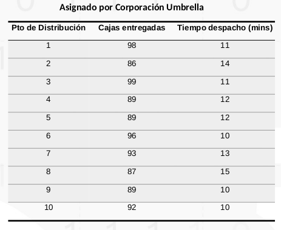
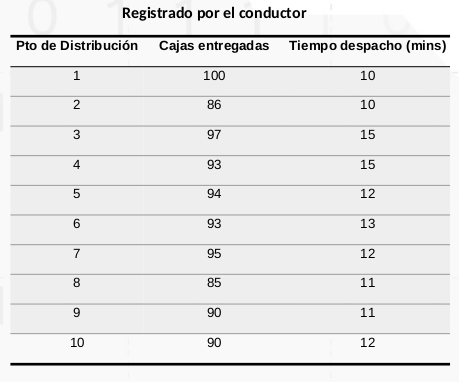

### Distribución de vacunas - Corporación Umbrella

El Departamento de Logística de Corporación Umbrella ha quedado muy contento con tu desarrollo anterior, puesto que ahora puede administrar los despachos de las vacunas con mayor eficiencia. Por lo tanto a decidido aumentar la capacidad de sus camiones con 1000 cajas.

Para mejorar aún más su proceso de despacho de vacunas, la Corporación Umbrella ha decidido implementar un sistema de planillas en el que se asignan a cada camión una Orden de Despacho con el número de cajas y los tiempos de despacho, por cada punto de distribución.

Estas planillas podrán ser incorporadas en tu sistema para llevar un mejor control entre “lo asignado” por Corporación Umbrella y “lo registrado” por el conductor de cada camión de Transportes del Norte.

Desarrolla una nueva funcionalidad que permita calcular, para cada punto de distribución:

1. La diferencia de cajas entregadas, reflejando “lo asignado” menos “lo registrado”. Los valores negativos corresponden a sobre-entregas (unidades entregadas de más).
2. La diferencia de tiempos de despacho, reflejando “lo asignado” menos “lo
registrado”. Los valores negativos corresponden a demoras en el punto de
distribución.
3. La eficiencia en los tiempos de despacho, reflejada como un porcentaje que toma como referencia “lo asignado”.

Este nuevo desarrollo debe generar un reporte con los cálculos anteriores, y además debe listar:

1. Los 3 puntos de distribución que registran mayores sobre-entregas.
2. Los 3 puntos de distribución que registran las mayores demoras.
3. Todos los puntos de distribución que registran ambas condiciones negativas: tanto sobre-entregas, como demora en su tiempo de despacho.

Nuevos estudios realizados por el departamento de logística dela Corporción Umbrlla, demuestran muestran que en los puntos de distribución mencionados en el reporte, es más probable que ocurran posibles robos de mercancía.

En las planillas del conductor, se registraron los siguientes resultados:

La salida esperada es la siguiente:

&nbsp;

Punto # 1

Diferencia de cajas = -2

Diferencia de tiempos = 1

Eficiencia = 9.1%

Punto # 2

Diferencia de cajas = 0

Diferencia de tiempos = 4

Eficiencia = 28.6%

. . . (Asi mismo para cada punto hasta el 10)

Punto # 10

Diferencia de cajas = 2

Diferencia de tiempos = -2

Eficiencia = -20.0%

Puntos con mayores demoras de tiempo:

Punto 3: -4

Punto 4: -3

Punto 6: -3

Puntos con mayores sobre-entrega:

Punto 5: -5

Punto 4: -4

Punto 1: -2

Puntos con los dos criterios negativos:

Punto 4

Punto 9

&nbsp;

**Recomendaciones**:

+ El ingreso de las planillas será mediante lista de tuplas.
+ Mantener el formato de la "salida esperada" (orden, palabras y signos). Para ello se recomienda copiar y pegar del ejemplo.
+ La plataforma discrimina por espacios y mayúsculas.
+ Redondear los números reales a 1 dígito.

